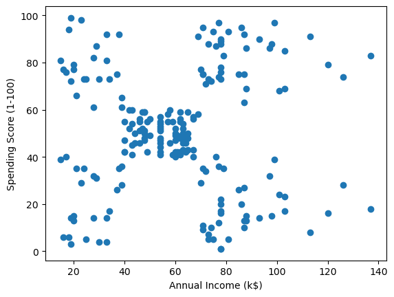
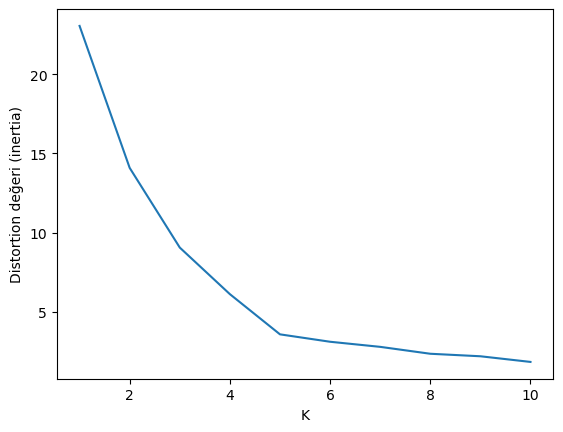
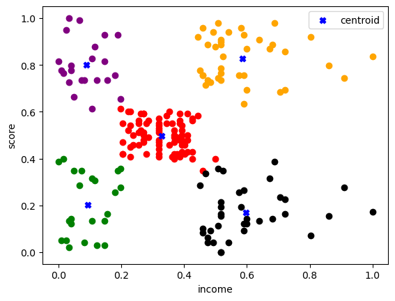

# Customer Segmentation AI

A machine learning project that segments customers based on their purchasing behavior using K-Means clustering algorithm.

---

## 📊 Results

### Customer Data Distribution

### Elbow Method for Optimal K

### Customer Segments (K=5)

---

## 🎯 Cluster Analysis

| Cluster | Characteristics |
|---------|-----------------|
| **Cluster 0** | Low Income, Low Spending |
| **Cluster 1** | Medium Income, Medium Spending |
| **Cluster 2** | High Income, Low Spending |
| **Cluster 3** | High Income, High Spending |
| **Cluster 4** | Low Income, High Spending |

---

## 🏗️ Project Structure

    CustomerSegmentation-AI/
    ├── data/
    │   └── customer-segment.csv
    ├── notebooks/
    │   └── CustomerSegmentation-AI.ipynb
    ├── src/
    │   ├── preprocessing.py
    │   ├── model.py
    │   └── train.py
    ├── results/
    │   ├── scatter_plot.png
    │   ├── elbow_plot.png
    │   └── clusters_plot.png
    ├── .gitignore
    ├── requirements.txt
    └── README.md

---

## 📋 Dataset

| Info | Details |
|------|---------|
| **Source** | [Kaggle - Mall Customer Segmentation](https://www.kaggle.com/datasets/vjchoudhary7/customer-segmentation-tutorial-in-python) |
| **Records** | 200 customers |
| **Features** | Annual Income (k$), Spending Score (1-100) |

---

## 🧠 Model Details

### Algorithm: K-Means Clustering

| Parameter | Value |
|-----------|-------|
| Number of Clusters (K) | 5 |
| K Selection Method | Elbow Method |
| Normalization | MinMaxScaler |
| Distance Metric | Euclidean |

### Why K=5?

The Elbow Method graph shows that the distortion (inertia) decreases significantly until K=5, after which the improvement becomes marginal. This indicates that 5 clusters optimally represent the customer segments.

---

## 🚀 Getting Started

### 1. Clone the Repository

    git clone https://github.com/Xiast-sw/CustomerSegmentation-AI.git
    cd CustomerSegmentation-AI

### 2. Install Dependencies

    pip install -r requirements.txt

### 3. Download Dataset

Download from [Kaggle](https://www.kaggle.com/datasets/vjchoudhary7/customer-segmentation-tutorial-in-python) and place it in `data/` folder as `customer-segment.csv`

### 4. Run Training

    python src/train.py

### 5. Or Use Jupyter Notebook

    jupyter notebook notebooks/CustomerSegmentation-AI.ipynb

---

## 🛠️ Technologies Used

| Category | Technologies |
|----------|--------------|
| **Language** | Python 3.x |
| **ML Library** | Scikit-learn |
| **Data Processing** | Pandas, NumPy |
| **Visualization** | Matplotlib |

---

## 📁 File Descriptions

| File | Description |
|------|-------------|
| `src/preprocessing.py` | Data loading and normalization |
| `src/model.py` | K-Means model and elbow method |
| `src/train.py` | Main training script with visualization |
| `notebooks/CustomerSegmentation-AI.ipynb` | Interactive analysis notebook |

---

## 📈 Business Insights

- **Cluster 3 (High Income, High Spending):** Premium customers - target for luxury products
- **Cluster 2 (High Income, Low Spending):** Potential customers - need engagement strategies
- **Cluster 4 (Low Income, High Spending):** Loyal customers - offer loyalty rewards
- **Cluster 0 (Low Income, Low Spending):** Budget customers - target with discounts
- **Cluster 1 (Medium Income, Medium Spending):** Average customers - general marketing

---

## 👤 Author

**Adil Buğra Aytar**

---

## 📝 License

This project is licensed under the MIT License.
